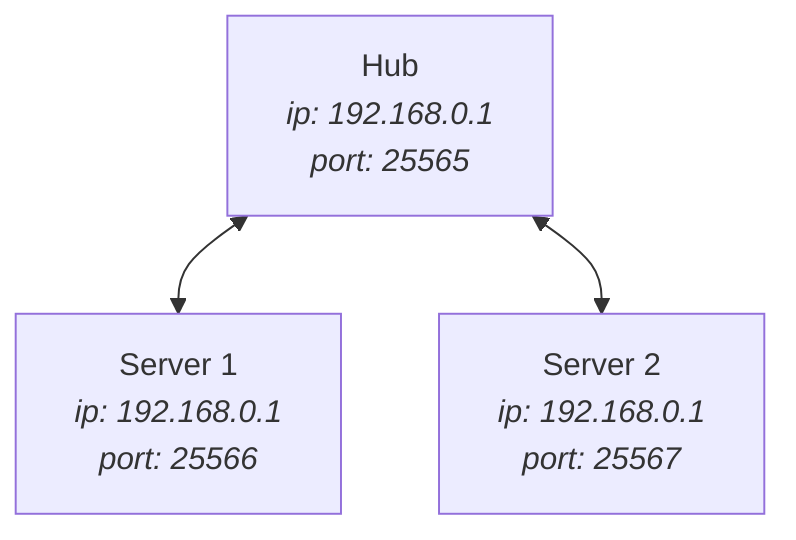

#  Servers Link

Servers Link is a `server-side` mod that lets you link multiple servers together.  
With this mod, players' inventory, achievements, chat *(including private messages)* and the player list are synchronized between the servers.

If you want to see this mod in action, check out this video: https://www.youtube.com/watch?v=-_P2IAu5Y0A  
A better video with more details may come in the future.

> [!IMPORTANT]
> This mod is still in beta, so please report any bugs you find.

If you want to install and configure this mod, continue reading this [README](README.md). If you want a more detailed explanation of how this mod works, or if you're a developer, take a look at the [EXPLANATIONS](EXPLANATIONS.md) and [USAGE](USAGE.md).  
If you have any questions, feel free to ask on [discord](https://discord.com/invite/ZeHm57BEyt)!

---

## Installation

As this mod is only `server-side` you first need to set up a Fabric server.  After your server is set up, put the `.jar` file downloaded from [Modrinth](https://modrinth.com/mod/servers-link) in the `./mods` folder (you also need to install [Fabric API](https://modrinth.com/mod/fabric-api)).  
Once you have put everything in the folder, start the server. It will immediately close with an error and the `servers-link.properties` file will be generated at the root of the server.

## Configuration

### Properties
As this mod uses the transfer system added in 1.20.5, you need to configure your server to accept transfers. In the `server.properties` file, set the following line:

```properties
accepts-transfers=true
```

Next, you have to configure `servers-link.properties`. This file contains the following options.

| Option                | Description                                                                                                                                                               |    Value     |
|-----------------------|---------------------------------------------------------------------------------------------------------------------------------------------------------------------------|:------------:|
| hub                   | If the server is the hub or not. Only one of your servers can be the hub.<br/>This is the server the players will use to connect.                                         | True / False |
| hub-ip                | This is not the IP used by players to connect, but the IP used to communicate between the servers.<br/>If all your servers are in local you can set this to  `127.0.0.1`. |  IP Address  |
| hub-port              | Same as above. If you want to connect servers located in another network, you must allow connections to this port.                                                        |     Port     |
| reconnect-last-server | Indicates whether players should be reconnected to the last server from which they disconnected.                                                                          | True / False |
| server-ip             | IP of the Minecraft server.                                                                                                                                               |  IP Address  |
| server-name           | Name of the server (multiple servers can't have the same name).                                                                                                           |    String    |
| server-port           | Port of the Minecraft server.                                                                                                                                             |     Port     |
| sync-chat             | If chat messages are shared between all servers.                                                                                                                          | True / False |
| sync-player-data      | If inventory, achievements and statistics of players are synchronized between servers.                                                                                    | True / False |
| sync-player-list      | If player list is synchronized between servers.                                                                                                                           | True / False |
| sync-roles            | If roles are synchronized between servers (support Player Roles).                                                                                                         | True / False |
| sync-whitelist        | If whitelist is synchronized between servers.                                                                                                                             | True / False |
| whitelist-ip          | Set to true if you don't want all IPs to be able to connect to the hub.                                                                                                   | True / False |
| whitelisted-ip        | A list of allowed IPs (eg: "192.168.0.1,192.168.0.2").                                                                                                                    | List of IPs  |

> [!WARNING]
> If you want sync-chat to be true, you must also have sync-player-list set to true.

> [!CAUTION]
> If `whitelist-ip` is set to `false` and the **hub's port is open**, anyone can install this mod and connect their server to your hub.

> [!IMPORTANT]
> All ports specified in `server-port` must remain open.  
> When you stop the hub server, all other servers are stopped.

### Example


For this example, all the servers are in local, and we want to use `59001` as the hub port.

#### Hub

```properties
hub=true
hub-ip=127.0.0.1
hub-port=59001
reconnect-last-server=true
server-ip=192.168.0.1
server-name=hub
server-port=25565
sync-chat=true
sync-player-data=true
sync-player-list=true
sync-roles=true
sync-whitelist=true
whitelist-ip=false
whitelisted-ip=
```

#### Server 1

```properties
hub=false
hub-ip=127.0.0.1
hub-port=59001
reconnect-last-server=true
server-ip=192.168.0.1
server-name=server-1
server-port=25566
sync-chat=true
sync-player-data=true
sync-player-list=true
sync-roles=true
sync-whitelist=true
whitelist-ip=false
whitelisted-ip=
```

#### Server 2

```properties
hub=false
hub-ip=127.0.0.1
hub-port=59001
reconnect-last-server=true
server-ip=192.168.0.1
server-name=server-2
server-port=25567
sync-chat=true
sync-player-data=true
sync-player-list=true
sync-roles=true
sync-whitelist=true
whitelist-ip=false
whitelisted-ip=
```

## Commands

This mod adds the `server` command and the following sub-commands.

|                 Sub-command                  | Description                                            |              Permissions |
|:--------------------------------------------:|--------------------------------------------------------|-------------------------:|
|                     list                     | Lists all connected servers.                           |            `server.list` |
|             join `[server-name]`             | Joins the server.                                      |            `server.join` |
|       join `[server-name]` `[player]`        | Makes the player join the server.                      |      `server.join.other` |
| join `[server-name]` `[player]` `[position]` | Makes the player join the server at the given position |   `server.join.position` |
|              whereis `[player]`              | Indicates on which server the player is.               |         `server.whereis` |
|               tpto `[player]`                | Teleports you to the player.                           |            `server.tpto` |
|              tphere `[player]`               | Teleports the player to your position.                 |          `server.tphere` |
|               run `[command]`                | Allows you to run a command on all servers.            |             `server.run` |