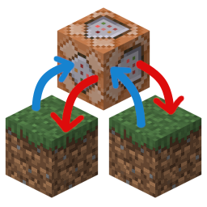
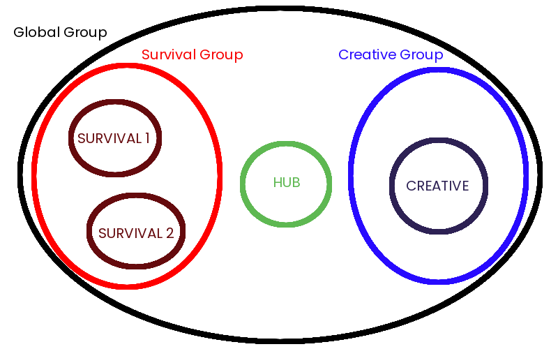

#  Servers Link

Servers Link is a `server-side` mod that lets you link multiple servers together.  
With this mod, players' inventory, achievements, chat *(including private messages)* and the player list are synchronized between the servers.

If you want to see this mod in action, check out this video: https://www.youtube.com/watch?v=-_P2IAu5Y0A  
A better video with more details may come in the future.

> [!IMPORTANT]
> This mod is still in beta, so please report any bugs you find.

If you want to install and configure this mod, continue reading this [README](README.md). If you want a more detailed explanation of how this mod works, or if you're a developer, take a look at the [EXPLANATIONS](EXPLANATIONS.md) and [USAGE](USAGE.md).  
If you have any questions, feel free to ask on [discord](https://discord.com/invite/ZeHm57BEyt)!

---

## Installation

As this mod is only `server-side` you first need to set up a Fabric server.  After your server is set up, put the `.jar` file downloaded from [Modrinth](https://modrinth.com/mod/servers-link) in the `./mods` folder (you also need to install [Fabric API](https://modrinth.com/mod/fabric-api)).  
Once you have put everything in the folder, start the server. It will immediately close with an error and the next thing to do will be to configure everything.

## Configuration

### Properties
As this mod uses the transfer system added in 1.20.5, you need to configure your server to accept transfers. In the `server.properties` file, set the following line:

```properties
accepts-transfers=true
```

Next, open the `config` folder on your server and create a new folder named `servers-link`. Inside this folder, you must always have a file named `info.json`. This file is used to describe all the information related to the current server.
The following options must be configured:

| Option       | Description                                                                                                                                                               |    Value     |
|--------------|---------------------------------------------------------------------------------------------------------------------------------------------------------------------------|:------------:|
| group        | The group in which the server will be located. Groups are explained in the next section.                                                                                  |    String    |
| gateway      | If the server is the gateway or not. Only one of your servers can be the gateway.<br/>This is the server the players will use to connect.                                 | True / False |
| gateway-ip   | This is not the IP used by players to connect, but the IP used to communicate between the servers.<br/>If all your servers are in local you can set this to  `127.0.0.1`. |  IP Address  |
| gateway-port | Same as above. If you want to connect servers located in another network, you must allow connections to this port.                                                        |     Port     |
| server-name  | Name of the server (multiple servers can't have the same name).                                                                                                           |    String    |
| server-ip    | IP of the Minecraft server.                                                                                                                                               |  IP Address  |
| server-port  | Port of the Minecraft server.                                                                                                                                             |     Port     |
| command-name | (optional) Name of the added command. If not specified defaults to /server.                                                                                               |    String    |
Here is an example file:
```json 
{
  "group": "global",
  "gateway": true,
  "gateway-ip": "127.0.0.1",
  "gateway-port": 59001,
  "server-name": "Hub",
  "server-ip": "127.0.0.1",
  "server-port": 25565,
  "command-name": "network"
}
```

> [!IMPORTANT]
> All ports specified in `server-port` must remain open.  
> When you stop the gateway server, all other servers are stopped.
> 
> [!TIP]
> To get Servers Link to work in a Velocity proxy setup, you need to set the `command-name` option in the `info.json` file to something other than `server` (for example, `network`).
>
> This is because Velocity uses the `/server` command by default.

If the server is your gateway, you must add another file named `config.json`. This file contains the general configuration settings for the gateway.

| Option                | Description                                                                                       |        Value         |
|-----------------------|---------------------------------------------------------------------------------------------------|:--------------------:|
| debug                 | Enables debug messages to be displayed in the console.                                            |     True / False     |
| global_player_count   | Set to true if you want the gateway player count to be the sum of each sub-server's player count. |                      |
| whitelist_ip          | Set to true if you don't want all IPs to be able to connect a server to the gateway.              |     True / False     |
| whitelisted_ip        | A list of allowed IPs (eg: ["192.168.0.1","192.168.0.2"]).                                        | List of IP Addresses |
| reconnect_last_server | Indicates whether players should be reconnected to the last server from which they disconnected.  |     True / False     |

Here is an example file:
```json
{
  "debug": false,
  "global_player_count": true,
  "whitelist_ip": false,
  "whitelisted_ip": [],
  "reconnect_last_server": true
}
```

> [!CAUTION]
> If `whitelist-ip` is set to `false` and the **gateway's port is open**, anyone can install this mod and connect their server to your gateway.

### Groups

If the server is the gateway, you must add another file named `groups.json` to define the groups.
For each group, you can configure the following options:

| Option      | Description                                                                            |    Value     |
|-------------|----------------------------------------------------------------------------------------|:------------:|
| chat        | If chat messages are shared between all servers.                                       | True / False |
| player-data | If inventory, achievements and statistics of players are synchronized between servers. | True / False |
| player-list | If player list is synchronized between servers.                                        | True / False |
| roles       | If roles are synchronized between servers (support Player Roles).                      | True / False |
| whitelist   | If whitelist is synchronized between servers.                                          | True / False |


> [!WARNING]
> If you set chat to true, you must also set player-list to true.

The default group is named `global`. For this group, you must configure all the options listed above.  
Then, you can add as many groups as you want. For each new group, you only need to configure the options that differ from those in the `global` group.

### Example

Let’s imagine we want to set up a hub server that will be the gateway, the entry point to all our servers.
In addition to the hub, we have two survival servers and one creative server.
The player list and chat should not be synchronized between the hub and the other servers. However, they should be synchronized between the survival servers and the creative server.
Player data should be synchronized only between the two survival servers, and not with the creative server.

The following `groups.json` correspond to this situation:

```json
{
  "groups": {
    "global": {
      "chat": false,
      "player_data": false,
      "player_list": false,
      "roles": false,
      "whitelist": false
    },
    "survival": {
      "player_data": true,
      "player_list": true,
      "chat": true
    },
    "creative": {
      "player_data": true,
      "player_list": true,
      "chat": true
    }
  },
  "rules": [
    {
      "groups": ["survival", "creative"],
      "player_list": true,
      "chat": true
    }
  ]
}
```

The `rules` section allow us to enable some settings between a defined set of servers.

And these are the `info.json` files for each server:

`Hub`
```json
{
  "group": "global",
  "gateway": true,
  "gateway-ip": "127.0.0.1",
  "gateway-port": 59001,
  "server-name": "Hub",
  "server-ip": "127.0.0.1",
  "server-port": 25565
}
```
`Creative`
```json
{
  "group": "creative",
  "gateway": false,
  "gateway-ip": "127.0.0.1",
  "gateway-port": 59001,
  "server-name": "Creative",
  "server-ip": "127.0.0.1",
  "server-port": 25566
}
```

`Survival 1`
```json
{
  "group": "survival",
  "gateway": false,
  "gateway-ip": "127.0.0.1",
  "gateway-port": 59001,
  "server-name": "Survival-1",
  "server-ip": "127.0.0.1",
  "server-port": 25567
}
```

`Survival 2`
```json
{
  "group": "survival",
  "gateway": false,
  "gateway-ip": "127.0.0.1",
  "gateway-port": 59001,
  "server-name": "Survival-2",
  "server-ip": "127.0.0.1",
  "server-port": 25568
}
```

Here is an example schema of this situation. You can find the configuration folder for each server [here](example).

> [!IMPORTANT]  
> The configuration files must be placed in the `config/servers-link` folder and the server IP addresses and ports must be the same as those specified in `info.json` files.



## Commands

This mod adds the `server` command (or the command specified in `info.json`) and the following sub-commands.

|                 Sub-command                  | Description                                            |              Permissions |
|:--------------------------------------------:|--------------------------------------------------------|-------------------------:|
|                     list                     | Lists all connected servers.                           |            `server.list` |
|             join `[server-name]`             | Joins the server.                                      |            `server.join` |
|       join `[server-name]` `[player]`        | Makes the player join the server.                      |      `server.join.other` |
| join `[server-name]` `[player]` `[position]` | Makes the player join the server at the given position |   `server.join.position` |
|              whereis `[player]`              | Indicates on which server the player is.               |         `server.whereis` |
|               tpto `[player]`                | Teleports you to the player.                           |            `server.tpto` |
|              tphere `[player]`               | Teleports the player to your position.                 |          `server.tphere` |
|               run `[command]`                | Allows you to run a command on all servers.            |             `server.run` |